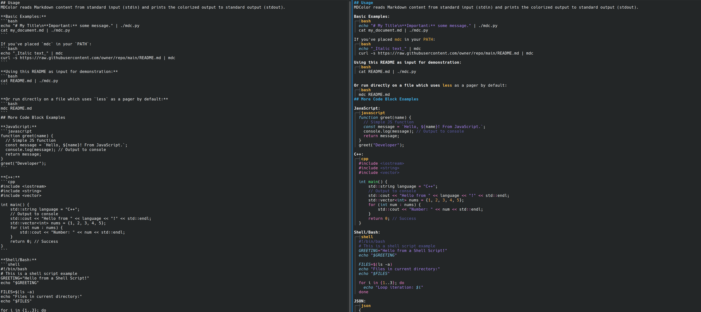

# MDColor (mdc) - Terminal Markdown Colorizer


*(Image shows markdown on the left and the output on the right)*

## Description
MDColor is a Python script designed for Linux terminals that takes Markdown text via piped input and outputs a colorized and styled version directly to your terminal. It enhances readability by applying ANSI escape codes for bold, italic, headers, code blocks (with syntax highlighting via Pygments for supported languages), lists, links, and more.

**This README itself is a demonstration! Try:**
```bash
cat README.md | ./mdc.py
# or, using less as a pager:
cat README.MD | ./mdc.py | less -R
# this is the same as:
./mdc.py README.MD
# Or, if installed to PATH:
# cat README.md | mdc
```

## Features
*   Colorized Headers (H1-H6)
*   **Bold text** and _Italic text_
*   Also handles **_Bold and Italic text_**
*   `Inline code` formatting
*   Code blocks with syntax highlighting for various languages (e.g., `python`, `javascript`, `c++`, `shell`, `json`):
    ```python
    def hello_python():
        # This is a Python comment
        greeting = "Hello from Python!"
        print(greeting)
    hello_python() # Call the function
    ```
*   Unordered lists:
    *   Item 1
    *   Item 2
        *   Sub-item A
        *   Sub-item B
    -   Alternative marker
    +   Yet another marker
*   Ordered lists:
    1.  First item
    2.  Second item
    3.  Third item
        1. Nested ordered item
*   > Blockquotes are styled too.
    > Multiple lines in a blockquote.
*   [Links with colored text and URL](https://github.com)
*   ---
    Horizontal rules (above this line)
*   Fallback styling for code blocks if no language is specified, the language is unknown, or Pygments is unavailable.

## Requirements
*   Python 3.6 or newer
*   Pygments library (for code block syntax highlighting):
    You can install it via pip: `pip install Pygments`

## Installation

1.  **Clone the repository (optional):**
    ```bash
    git clone https://github.com/cduk/mdcolor.git
    cd mdcolor
    ```
    Alternatively, you can just download the `mdc.py` script.

2.  **Ensure Pygments is installed:**
    If you haven't already, install Pygments:
    ```bash
    pip install pygments
    # or for a specific Python 3 installation:
    # python3 -m pip install pygments
    ```

3.  **Make the script executable:**
    ```bash
    chmod +x mdc.py
    ```

4.  **Place in your PATH (optional but highly recommended for convenience):**
    Move the `mdc.py` script to a directory that is included in your system's `PATH` environment variable. A common choice is `~/.local/bin/`.
    ```bash
    mkdir -p ~/.local/bin
    mv mdc.py ~/.local/bin/mdc # You can rename it to 'mdc'
    ```
    If `~/.local/bin` is not in your `PATH`, add it by editing your shell configuration file (e.g., `~/.bashrc`, `~/.zshrc`):
    ```bash
    echo 'export PATH="$HOME/.local/bin:$PATH"' >> ~/.your_shell_rc_file # e.g., ~/.bashrc
    source ~/.your_shell_rc_file # Apply changes
    ```
    After this, you can run the script by simply typing `mdc` from any directory.

## Usage
MDColor reads Markdown content from standard input (stdin) and prints the colorized output to standard output (stdout).

**Basic Examples:**
```bash
echo "# My Title\n**Important:** some message." | ./mdc.py
cat my_document.md | ./mdc.py
```

If you've placed `mdc` in your `PATH`:
```bash
echo "_Italic text_" | mdc
curl -s https://raw.githubusercontent.com/owner/repo/main/README.md | mdc
```

**Using this README as input for demonstration:**
```bash
cat README.md | ./mdc.py
```


**Or run directly on a file which uses `less` as a pager by default:**
```bash
mdc README.md
```
## More Code Block Examples

**JavaScript:**
```javascript
function greet(name) {
  // Simple JS function
  const message = `Hello, ${name}! From JavaScript.`;
  console.log(message); // Output to console
  return message;
}
greet("Developer");
```

**C++:**
```cpp
#include <iostream>
#include <string>
#include <vector>

int main() {
    std::string language = "C++";
    // Output to console
    std::cout << "Hello from " << language << "!" << std::endl;
    std::vector<int> nums = {1, 2, 3, 4, 5};
    for (int num : nums) {
        std::cout << "Number: " << num << std::endl;
    }
    return 0; // Success
}
```

**Shell/Bash:**
```shell
#!/bin/bash
# This is a shell script example
GREETING="Hello from a Shell Script!"
echo "$GREETING"

FILES=$(ls -a)
echo "Files in current directory:"
echo "$FILES"

for i in {1..3}; do
  echo "Loop iteration: $i"
done
```

**JSON:**
```json
{
  "name": "MDColor Project",
  "version": "1.1.0",
  "description": "A terminal markdown colorizer with Pygments syntax highlighting.",
  "main": "mdc.py",
  "keywords": [
    "markdown",
    "terminal",
    "cli",
    "color",
    "syntax-highlighting",
    "pygments"
  ],
  "author": "Your Name / GitHub Username",
  "license": "MIT",
  "dependencies": {
    "python": ">=3.6",
    "Pygments": ">=2.0"
  },
  "scripts": {
    "test": "echo \"Error: no test specified\" && exit 1"
  }
}
```

**Unspecified Language (Fallback/Pygments Guessing):**
```
This is a generic code block.
No language specified.
It should use the fallback styling or Pygments' best guess.
$ example_command --option "some value"
Another line of text here.
```

**HTML:**
```html
<!DOCTYPE html>
<html lang="en">
<head>
    <meta charset="UTF-8">
    <meta name="viewport" content="width=device-width, initial-scale=1.0">
    <title>Sample HTML</title>
    <style>
        body { font-family: sans-serif; }
        h1 { color: navy; }
    </style>
</head>
<body>
    <h1>Hello, HTML!</h1>
    <p>This is a paragraph with a <a href="#">link</a>.</p>
    <!-- This is an HTML comment -->
    <div class="container">
        Content goes here.
    </div>
</body>
</html>
```

## Known Limitations
*   **Not a full CommonMark parser:** Complex nested structures or some edge cases in Markdown syntax might not be rendered perfectly.
*   **Escaped Characters:** Does not currently handle escaped Markdown characters (e.g., `\*` might be interpreted as italic start/end).
*   **Tables:** Markdown tables are not supported.
*   **Pygments Formatter Style:** The `Terminal256Formatter` style is currently hardcoded to `native`. This could be made configurable.
*   **Performance:** For extremely large files, line-by-line regex processing might be slower than a dedicated parser.

## License
This project is licensed under the MIT License - see the [LICENSE](LICENSE) file for details.

---
_Happy coloring!_
